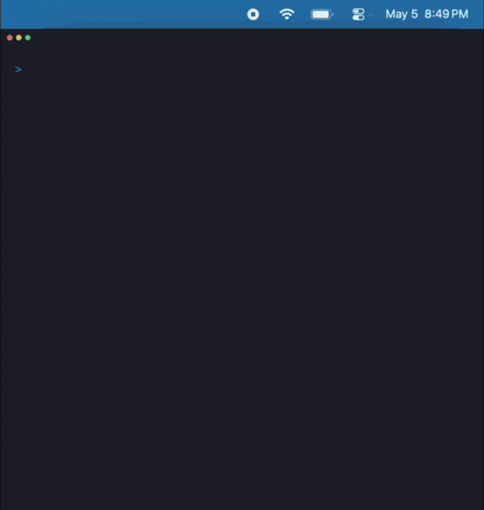

# macform

Declarative macOS system settings - define your preferences in YAML and apply them anywhere.



## Install

```
brew install vsimon/tap/macform
```

## Quick start

```bash
# Snapshot current settings into a spec file
macform generate

# Preview what would change
macform plan

# Apply changes
macform apply
```

## Available settings

[`examples/macform.yaml`](examples/macform.yaml) lists every supported setting with its description, type, valid values, and macOS default. Copy it as a starting point for your own spec.

## Compatibility

Requires macOS Tahoe or later.

## Development

Requires [mise](https://mise.jdx.dev) (`brew install mise`)

Run to get started:

```bash
mise install
mise build
```

Run tests:

```bash
mise test
```

## Documentation

Full product requirements and design: [docs/spec.md](docs/spec.md)
